# Proactive healthcare management system with AWS Kinesis Streams and IBM Cloud Pak for Data

In the healthcare domain, there is a lot of real-time data that is generated. This real-time data needs to be monitored to generate predictions and alerts for healthcare professionals. A manual monitoring of such data is difficult. Hence in this code pattern we add AI based predictions and automate the monitoring of healthcare data. To demonstrate IBM Cloud pak for Data technology on AWS Cloud, we have taken the use case of predicting cardiac events based on real-time monitoring of patients health data.

In this code pattern, you will learn to build a machine learning model with no code on IBM Cloud Pak for Data, create a streaming flow on AWS Cloud and invoke the model to get predictions in real-time.

IBM Services used in the code pattern:
* IBM Cloud Pak for Data
  * Watson Studio
  * Watson SPSS Modeler
  * Watson Machine Learning

AWS Services used in the code pattern:
* AWS IAM Roles
* Amazon Kinesis
* AWS Lambda Functions
* Amazon CloudWatch
* Amazon S3

Anyone using AWS services will be able to seamlessly plug in the IBM Cloud pak for Data Watson Machine Learning model to their flow.

Once you complete the code pattern, you will learn to:

* Create a S3 bucket on AWS.
* Create an event notification for the S3 bucket to trigger functions on adding data to the bucket.
* Create IAM Roles to AWS Services.
* Create a Lambda producer function to encrypt the data from S3 bucket and send it to Amazon Kinesis.
* Create a Machine Learning model using SPSS Modeler on IBM Cloud Pak for Data.
* Deploy the Machine Learning model on IBM Cloud Pak for Data Watson Machine learning and get the APIs to Invoke the model.
* Create a Lambda consumer function to decrypt the streaming data from Amazon Kinesis and send it to the model to get predictions.
* View the real-time predections from IBM Cloud Pak for Data Watson Machine Learning in Amazon CloudWatch.

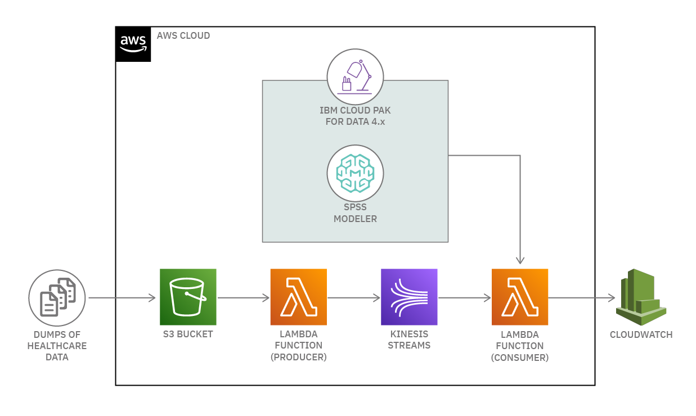

## Flow

1. Healthcare data is dumped into a S3 bucket on AWS.
1. A producer lambda function is triggered to encrypt the data and stream it to AWS Kinesis.
1. A machine learning model is trained in IBM Cloud pak for Data Watson Studio using SPSS Modeler and the model is deployed in Watson Studio Machine Learning.
1. A consumer lambda function reads the data from kinesis streams.
1. The consumer function invokes the model from Watson Studio Machine Learning with the data received from kinesis streams.
1. The data streamed from the kinesis along with the predictions received from the Watson Studio Machine Learning are then visualized in AWS CloudWatch.

# Pre-requisites

1. [AWS Account](https://portal.aws.amazon.com/billing/signup#/start)
1. [AWS CLI](https://aws.amazon.com/cli/)
1. [AWS Kinesis](https://aws.amazon.com/kinesis/)
1. [AWS S3](https://aws.amazon.com/s3/)
1. [IBM Cloud Pak for Data 4.x on AWS](https://aws.amazon.com/quickstart/architecture/ibm-cloud-pak-for-data/)

# Steps

1. [Create a S3 bucket](#1-create-a-s3-bucket)
1. [Create a Kinesis Stream](#2-create-a-kinesis-stream)
1. [Create an IAM Role to AWS services](#3-create-an-iam-role-to-aws-services)
1. [Create Producer Lambda Function](#4-create-producer-lambda-function)
1. [Create an event notification for the S3 bucket](#5-create-an-event-notification-for-the-s3-bucket)
1. [Build and Deploy Watson Machine Learning model](#6-build-and-deploy-watson-machine-learning-model)
    * 6.1. [Build a machine learning model using Guided ML](#61-build-a-machine-learning-model-using-guided-ml)
    * 6.2. [Deploy the model in Watson Machine Learning](#62-deploy-the-model-to-watson-machine-learning)
    * 6.3. [Copy the Watson Machine Learning Token](#63-copy-the-watson-machine-learning-token)
1. [Create Consumer Lambda Function](#7-create-consumer-lambda-function)
1. [Upload data to S3 bucket](#8-upload-data-to-s3-bucket)
1. [View Logs in CloudWatch](#9-view-logs-in-cloudwatch)

## 1. Create a S3 bucket

Create a S3 bucket in AWS by refering to the AWS documentation.

* [Creating a bucket](https://docs.aws.amazon.com/AmazonS3/latest/userguide/create-bucket-overview.html)
* Click on Create Bucket and enter a name for the bucket (for example, 'cpdbucket').
* Keep the `Block all public access` enabled and then click on `Create bucket` button.

## 2. Create a Kinesis Stream

Create a Kinesis stream in AWS by following the steps:

* Sign in to the AWS Management Console and open the Kinesis console at <https://console.aws.amazon.com/kinesis>
* Click on **Data Streams** in the navigation pane.
* Click on **Create data stream**.
* Enter a name for your stream (for example, `myDataStream`).
* Enter `2` for the number of shards.
* Click on **Create data stream**.

## 3. Create an IAM Role to AWS services

* [Create an IAM Role](https://console.aws.amazon.com/iamv2/home#/roles/create?step=selectEntities).
  * Select **Trusted entity type** as `AWS service`
  * Select **Use case** as `Lambda` and click **Next**
  * Add the following permission policies:
    * `CloudWatchFullAccess`
    * `AmazonKinesisFullAccess`
    * `AmazonS3FullAccess`
  * Click on **Next**
  * Enter a **role name** and click on **Create role**
 
Make a note of the **role name** as it will be used in subsequent steps.
 
For more information, see [Creating a role to delegate permissions to an AWS service](https://docs.aws.amazon.com/IAM/latest/UserGuide/id_roles_create_for-service.html) AWS documentation.

## 4. Create Producer Lambda function

Create a lambda function in AWS by following the steps:

* Open the [Functions page](https://console.aws.amazon.com/lambda/home#/functions) on the Lambda console.
* Click on **Create function**.
* Under Basic information, do the following:
  * For Function name, enter `Producer`.
  * For Runtime, confirm that `Node.js 14.x` is selected.
  * Expand the **Change default execution role** and select **Use an existing role**.
  * Select the **role name** created in [Step 3](#3-create-an-iam-role-to-aws-services).
* Click on **Create function**.

In the **Code source** enter the below code by replacing the existing code.

```javascript
const AWS = require('aws-sdk');
const KinesisStreamsName = '<KinesisStreamsName>';
const Region = '<Region>'; // Example: us-east-1, ap-south-1, etc.

AWS.config.update({
    region: Region
})

const s3 = new AWS.S3();
const kinesis = new AWS.Kinesis();

exports.handler = async (event) => {
   console.log(JSON.stringify(event));
   const bucketName = event.Records[0].s3.bucket.name;
   const keyName = event.Records[0].s3.object.key;
   const params = {
       Bucket: bucketName,
       Key: keyName
   }
   
   await s3.getObject(params).promise().then(async (data) => {
       const dataString = data.Body.toString();
       const payload = {
           data: dataString
       }
       
       await sendToKinesis(payload, keyName);
   }, error => {
       console.log(error);
   })
};

const sendToKinesis = async (payload, partitionKey) => {
    const params = {
        Data: JSON.stringify(payload),
        PartitionKey: partitionKey,
        StreamName: KinesisStreamsName
    }
    
    await kinesis.putRecord(params).promise().then(response => {
        console.log(response);
    }, error => {
        console.log(error);
    })
};
```

In line no 2, replace `<KinesisStreamsName>` with the name of the Kinesis Streams you created.

Also in line no 3, replace `<Region>` with the region where the Kinesis Streams is created.

Click on **Deploy**.

## 5. Create an event notification for the S3 bucket

Create an event notification for the S3 bucket. This will allow the producer lambda function to trigger when the data is uploaded to the S3 bucket.

To enable and configure event notifications for an S3 bucket follow the steps:

* Sign in to the AWS Management Console and open the Amazon S3 console at <https://console.aws.amazon.com/s3/>

* In the Buckets list, choose the name of the bucket that you created.
* Click on Properties.
* Navigate to the Event Notifications section and click on Create event notification.
* In the General configuration section, specify event name as **Data-upload**. Specify suffix as **.csv** to limit the notifications to objects with keys ending in the specified characters.

>Note: If you don't enter a name, a globally unique identifier (GUID) is generated and used for the name.

* In the Event types section, select **All object create events**.

>Note: Before you can publish event notifications, you must grant the Amazon S3 principal the necessary permissions to call the relevant API to publish notifications to a Lambda function, SNS topic, or SQS queue.

* Select the destination type as **Lambda Function**. Specify the lambda function name as **producer**.
* Click on Save changes, and Amazon S3 sends a test message to the event notification destination.

For more information, see Supported event destinations in the Amazon Simple Storage Service Developer Guide.

* [Creating an event notification](https://docs.aws.amazon.com/AmazonS3/latest/dev/NotificationHowTo.html)

## 6. Build and Deploy Watson Machine Learning model

Access the Cloud pak for Data 4.x Dashboard on AWS.

>Note: If you don't have Cloud pak for Data deployed on your AWS console, you can refer [AWS Cloud Pak for Data 4.x on AWS](https://aws.amazon.com/quickstart/architecture/ibm-cloud-pak-for-data/) for deployment guide.

Make sure your have enabled the following services in Cloud Pak for Data:

* **Watson Studio**
* **Watson Machine Learning**

### 6.1. Build a machine learning model using Guided ML

Guided ML is a tool that helps you build machine learning models. It is a part of Watson Studio in the Cloud Pak for Data 4.x.

Follow the steps to build a machine learning model using Guided ML:

* Create a project in Watson Studio.
  * From the left navigation pane, click on **Projects**.
  * Click on **All projects**.
  * Click on **New project**.
  * Select project type as **Analytics project**.
  * Click on **Create an empty project**.
  * Enter name and description for the project.
  * Click on **Create**.

* Download and unzip the dataset.
  * We are using the [Heart Attack Analysis & Prediction Dataset](https://www.kaggle.com/rashikrahmanpritom/heart-attack-analysis-prediction-dataset) from Kaggle.
  * Download the dataset and unzip it.
  * We will be working with the `heart.csv` and `02Saturation.csv` files.

* Add the datasets to the project.
  * From within the project that you have created, click on **Add to project** on the top right. Select **Data**.
  * A Data panel will appear. Click on **browse** and upload the `heart.csv` and `02Saturation.csv` files.
  * You can view the Datasets by selecting the **Assets** tab within the project.
    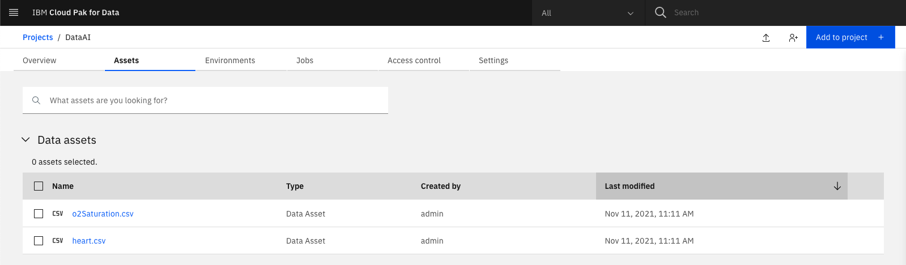

* Create a SPSS Modeler Flow.
  * From within the project that you have created, click on **Add to project** on the top right. Select **Modeler flow**.
  * Select **From File** tab on top.
  * Click on **browse** and upload the `heart_attack_modeler_flow.str` file.
  * Click on **Create**.
  * A Modeler Flow panel will appear.
    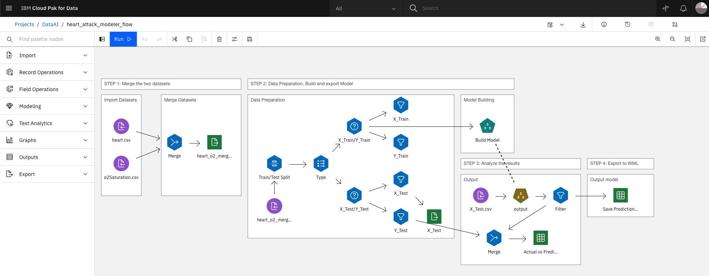

* Import the datasets in the Modeler Flow.
  * Double click on the `heart.csv` node in the **Import datasets** block in the SPSS Modeler Flow.

    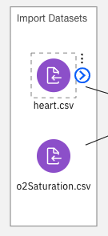
  * A Data Asset panel will appear. Click on **Select data asset**.
    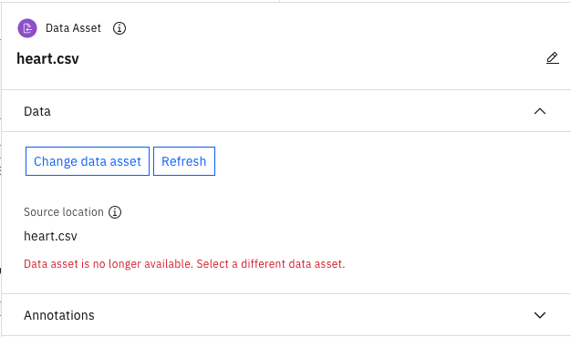

  * Choose the **Data asset** and click on `heart.csv`.
  
    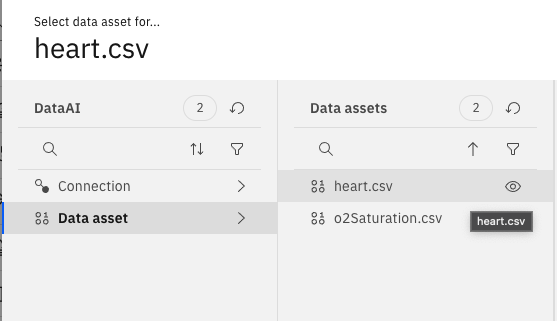
  * Click on **Select**.
  * Leave the **File formatting settings** as default and click on **Save**.

    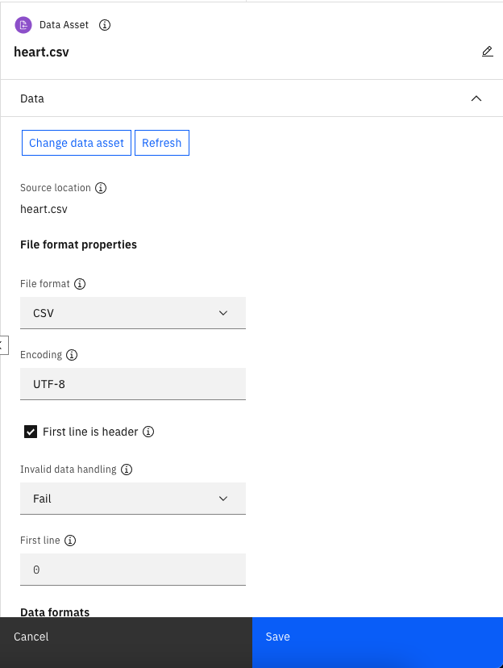

* Similarly Double click on the `02Saturation.csv` node in the Import datasets block and select the `02Saturation.csv` file.

* Once the Dataset is loaded, you need to perform 4 steps to build the model.

#### STEP 1: Merge the two datasets

* You need to run the `heart_o2_merged.csv` node to merge both the `heart.csv` and `02Saturation.csv` datasets.
  * Click on the `heart_o2_merged.csv` node. Click on the three dots icon and select **Run**.

    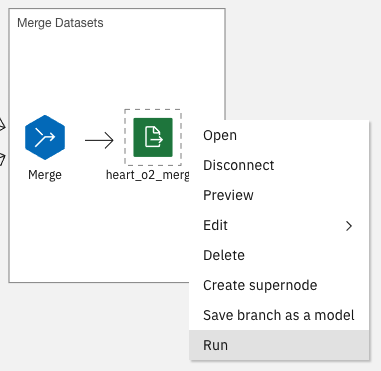

* This will merge the two datasets and create a new dataset called `heart_o2_merged.csv`.

  >Note: You can view the dataset by selecting the **Assets** tab within the project.

#### STEP 2: Data Preparation, Build and export Model

* You need to load the merged dataset into the SPSS Modeler Flow.
  * Double click on the `heart_o2_merged.csv` node in the **Data Preparation** block in the SPSS Modeler Flow.

    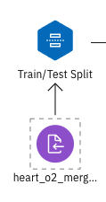

  * A Data Asset panel will appear. Click on **Select data asset**.

  * Choose the **Data asset** and click on `heart_o2_merged.csv`.

    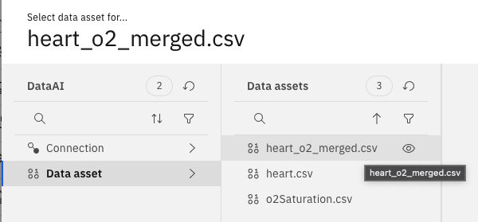

  * Click on **Select**.

  * Leave the **File formatting settings** as default and click on **Save**.

* Once the Dataset is injested in the SPSS Modeler Flow, 60% of the data is split into training data named as `X_Train` and `Y_Train`. The remaining 40% of the data is split into testing data named as `X_Test` and `Y_Test`.

* `X_Train` and `X_Test` are the input features and `Y_Train` and `Y_Test` are the target variables for the training and testing data.

* You will need to run the `X_Text` node to export the input features for testing and evaluating the model.
  * Click on the `X_Text` node in the **Data Preparation** block. Click on the three dots icon and select **Run**.

    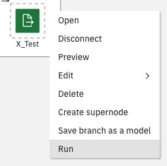

* Finally, build the model.
  * Click on the `Build Model` node in the **Model Building** block in the SPSS Modeler Flow. Click on the three dots icon and select **Run**.

    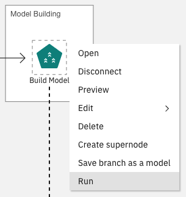

  >Note: This process will take some time to complete.

#### STEP 3: Analyze the results

* Once the model is built, you can evaluate the different models and their accuracy and other parameters.
  * Click on the `Output` node in the **Output** block in the SPSS Modeler Flow. Click on the three dots icon and select **View Model**.

    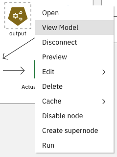

  * You will see a set of one or more models generated by the Auto Classifier node, each of which can be individually viewed or selected for use in scoring.

    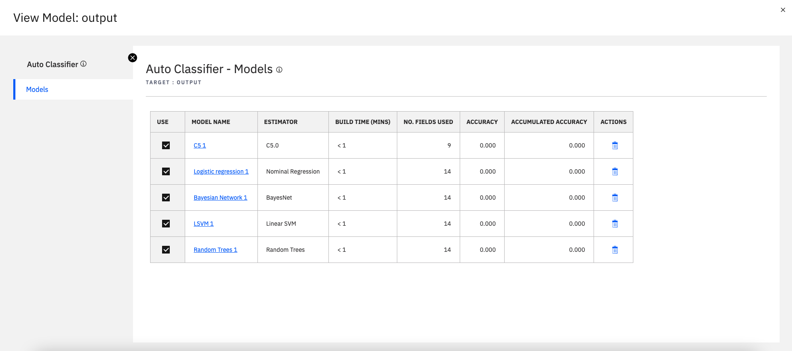

  * For the [Heart Attack Analysis & Prediction Dataset](https://www.kaggle.com/rashikrahmanpritom/heart-attack-analysis-prediction-dataset), auto classifier will generate 5 models. All the models can be individually viewed by selecting them.
    * C5
      * You can view C5 model details such as **Model Information**, **Top Decision Rules** and **Tree Diagram**.

        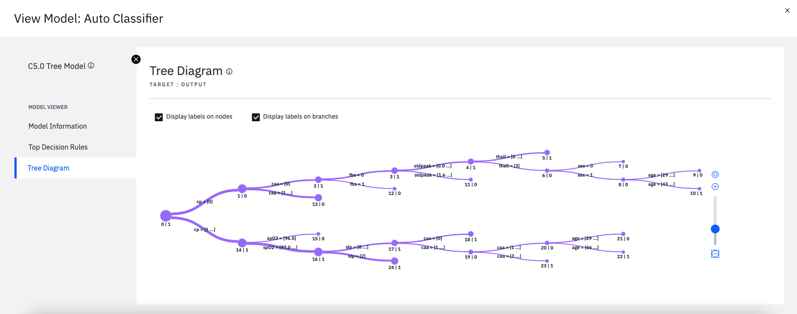

    * Logistic regression
      * You can view Logistic regression model details such as **Pseudo R-Square**, **Case Processing Summary**, **Model Fitting Information** and **Parameter Estimates**.

        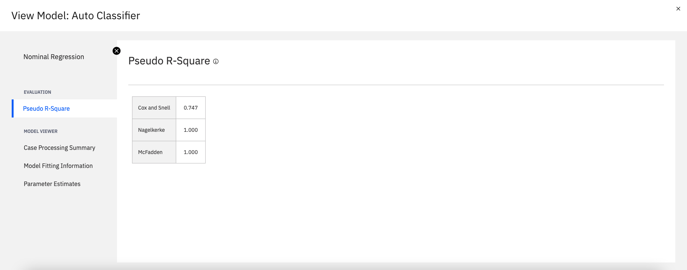

    * Bayesian Network
      * You can view Bayesian Network model details such as **Model Information** and **Network Graph**

        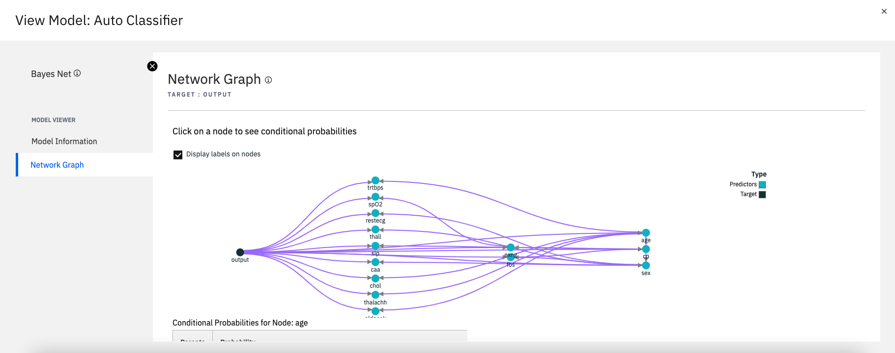

    * Linear SVM
      * You can view Linear SVM model details such as **Model Evaluation**, **Confusion Matrix**, **Model Information**, **Records Summary**, **Feature Importance** and **Parameter Estimates**.

        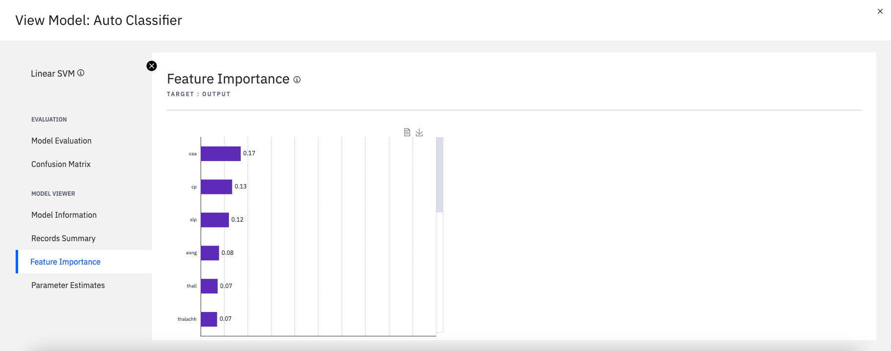

    * Random Trees
      * You can view Random Trees model details such as **Model Evaluation**, **Confusion Matrix**, **MODEL VIEWER**, **Model Information**, **Records Summary**, **Feature Importance** and **Top Decision Rules**.

        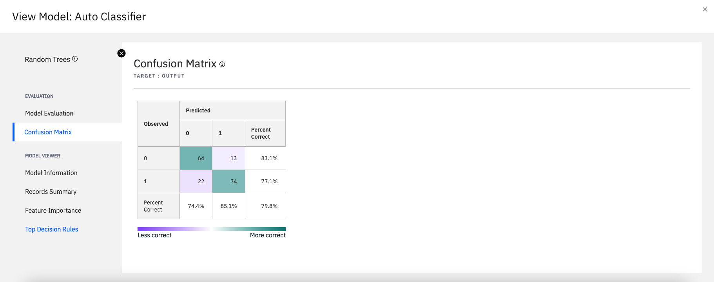
  
* Aditionally, you can check the Target variable prediction with confidence scores.
  * Double click on the `X_Test.csv` node in the **Data Preparation** block in the SPSS Modeler Flow.

    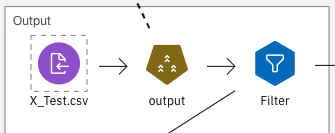

  * A Data Asset panel will appear. Click on **Select data asset**.

  * Choose the **Data asset** and click on `X_Test.csv`.

    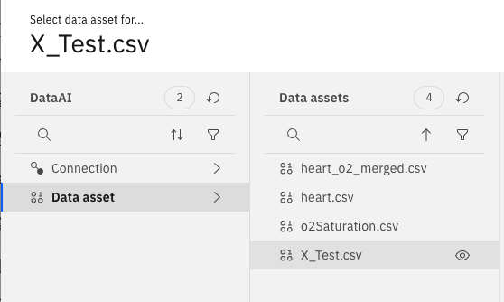

  * Click on **Select**.

  * Leave the **File formatting settings** as default and click on **Save**.

  * Now select the `Actual vs Prediction` node in the **Output** block in the SPSS Modeler Flow. Click on the three dots icon and select **Preview**.

    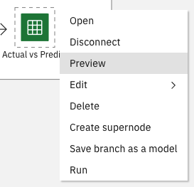
  
  * You can see the actual output and the model output with the confidence scores.

    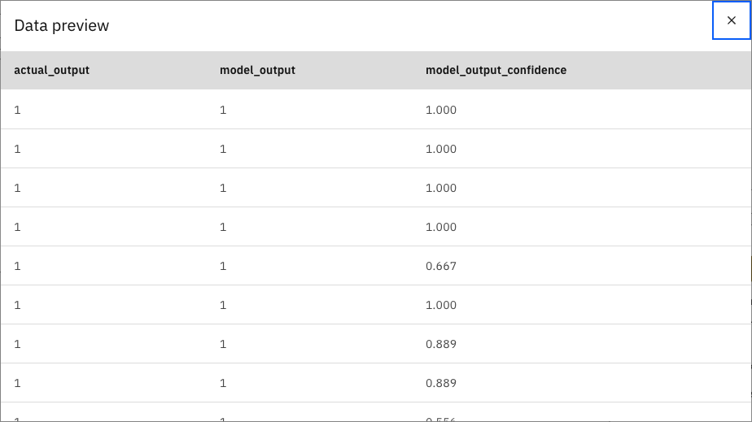

#### Step 4: Save the model to the project

* Now that you have successfully built the model and evaluated its accuracy, you can save the model to the project.
  * Click on the `Save Predictions` node in the **Output model** block in the SPSS Modeler Flow. Click on the three dots icon and select **Run**.

    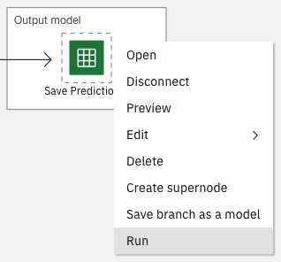

* On the top bar, click on the **Save Model** button.
  
    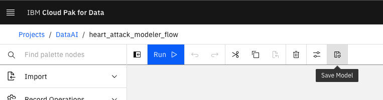

* Select the **Saving mode** as `Scoring branch`. Select the **Branch terminal node** as `Save Predictions Model`. Enter a **Model name** and click on **Save**.

    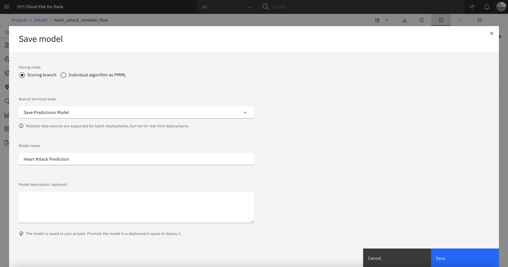

* The model will be saved to the project.

### 6.2. Deploy the model to Watson Machine Learning

* Goto the project in your Cloud Pak for Data.
  * From the left navigation pane, click on **Projects**.
  * Click on **All projects**.
  * Select the project you created in the previous step.

* Under the **Assets** tab, in the **Models** section you will see the model you saved in the previous step.

    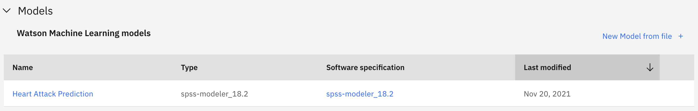

* Click on the **Model**.

* You can see the overview of the model such as input and output columns.

    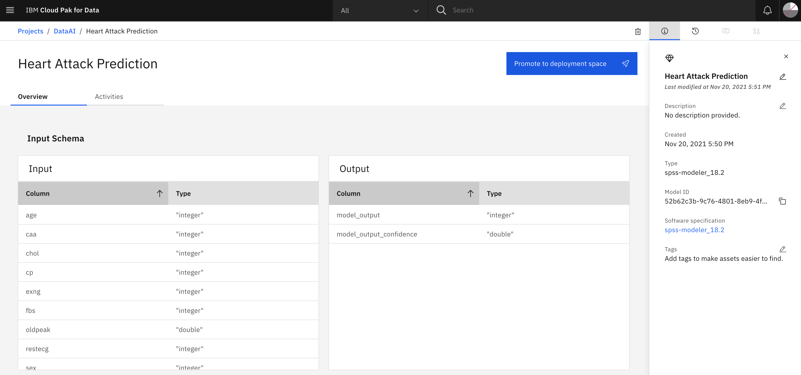

* Click on **Promote to deployment space**.
  * Select the desired **Target space** or create a new deployment space.
  * Select the **goto the model in the space after promoting it**.
  * Click on **Promote**.

  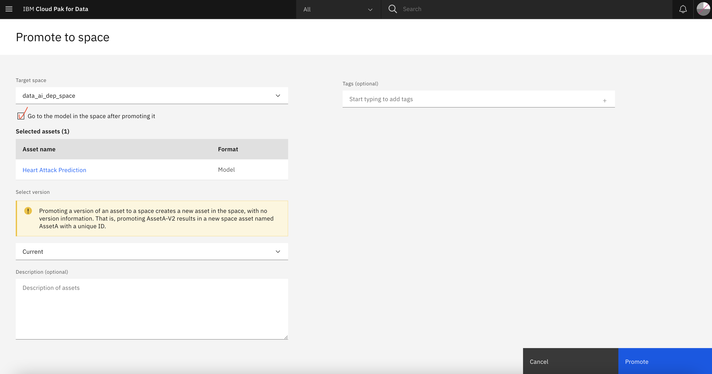

* Once the model is promoted to deployment space, you can click on the **deploy** button.

  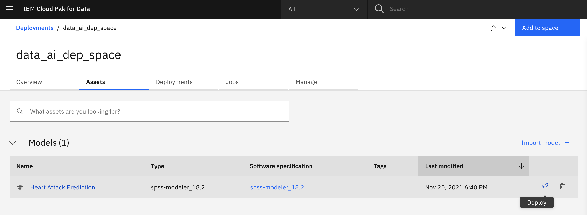

* Select the **Deployment type** as `Online`.
* Enter the **Deployment name** and click on **Create**.

  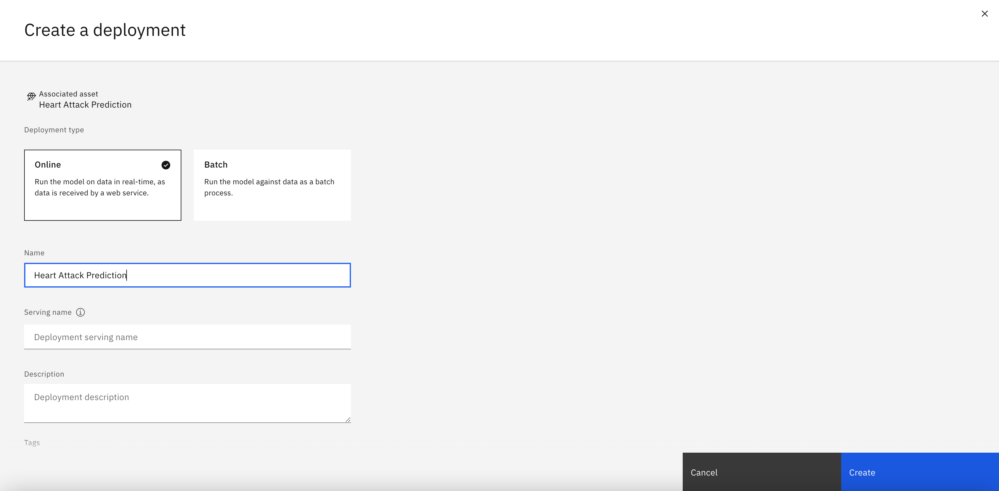

* You can check the staus of the model under the **Deployments** tab in the Deployment Space.

  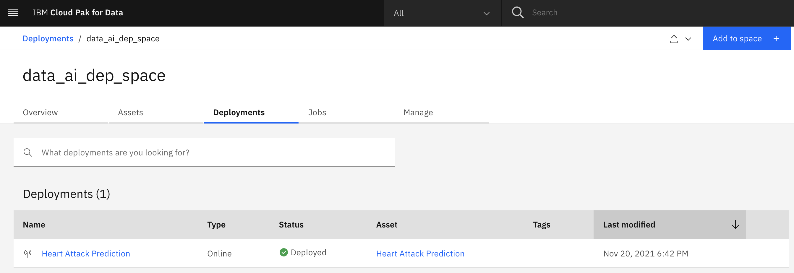

* Once the model status is **Deployed**, click on the model name.
  * Under the API Reference tab, copy the `Endpoint URL`.

  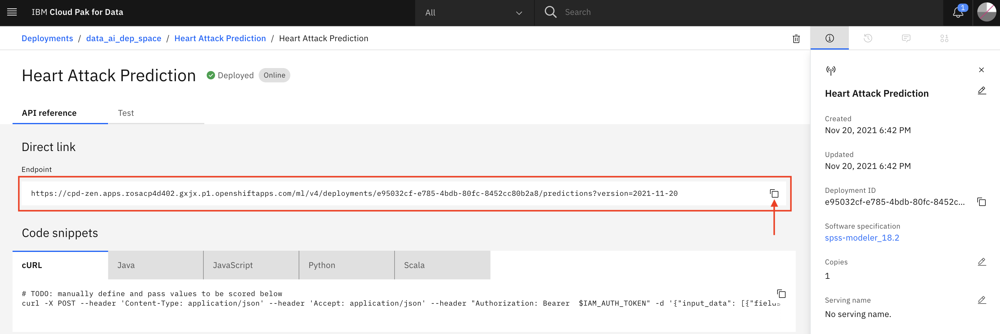

  * **Note:** Copy the `Endpoint URL` as it is required in the next step.

### 6.3. Copy the Watson Machine Learning Token

* Once the model is deployed and running, you will have to copy the `wmlToken`.
  * In terminal, run the following curl command.

    ```bash
    curl -k <CloudPakforData_URL>/v1/preauth/validateAuth -u USER:PASSWORD | sed -n -e 's/^.*accessToken":"//p' | cut -d'"' -f1
    ```
  
  >Note: Replace the `<CloudPakforData_URL>` with your cloud pak for data URL. And also replace the `USER` and `PASSWORD` with the `username` and `password` used to sign into Cloud Pak for Data.

  * An access token will be displayed on the terminal. **Copy the entire token** as it is required in the next step.

## 7. Create Consumer Lambda function

Create a lambda function in AWS by following the steps:

* Open the [Functions page](https://console.aws.amazon.com/lambda/home#/functions) on the Lambda console.
* Click on **Create function**.
* Under Basic information, do the following:
  * For Function name, enter `Consumer`.
  * For Runtime, confirm that `Node.js 14.x` is selected.
  * Expand the **Change default execution role** and select **Use an existing role**.
  * Select the **role name** created in [Step 3](#3-create-an-iam-role-to-aws-services).
* Click on **Create function**.

In the **Function overview** section, click on **add trigger**.
* Under **Trigger configuration** select **Kinesis**.
   * Select Kinesis stream that you created in [Step 2](#2-create-a-kinesis-stream)
   * Select Consumer as `no consumer`
   * Batch size as `100`
   * Leave Batch window - optional blank
   * Starting position as `Latest`
   * Finally click on **Add**.
   
In the **Code source** enter the below code by replacing the existing code.

```javascript linenums="1"
const https = require('https');

// Initialize Cloud pak for Data Machine Learning credentials

const token = "<watson-machine-learning-token>";
const iamToken = "Bearer " + token;
const scoring_url = "<watson-machine-learning-url>";

const scoring_hostname = scoring_url.split('://')[1].split('.com')[0] + ".com";
const path = scoring_url.split('.com')[1];
let port=0;

scoring_url.split('://')[0] === "https" ? port=443 : port=80;

// API call setup

const APIcall = async (options, payload) => {

    const promise = new Promise(function(resolve, reject) {
        var req = https.request(options, function(res) {
          res.setEncoding('utf8');
    
          res.on('data', function (data) {
            let result = JSON.parse(data);
            resolve(result.predictions[0].values[0]);
          });
        });
        
        req.on('error', function(e) {
          reject('problem with request: ' + e.message);
        });
        
        req.write(JSON.stringify(payload));
        
        req.end();
    });
      return promise;
};

// Convert the Kinesis Stream into an array

const processData = (data) => {
    const regex = /[0-9]+(\.[0-9]+)?/g;
    let array_of_values_to_be_scored = [];
    let datarefined = data.data.split('\r\n');
    for(let i = 1; i < datarefined.length-1; i++){
        let temp = datarefined[i].match(regex);
        // parse int the string to int
        
        if (temp != null) {
            for(let j = 0; j < temp.length; j++){
                temp[j] = parseFloat(temp[j]);
            }
            array_of_values_to_be_scored.push(temp); 
        }
    }

    return (array_of_values_to_be_scored);
};

// AWS Lambda event handler

exports.handler = async function(event) {
    
    let scoringpayload = [];
    
    for (const records of event.Records){
        const data = JSON.parse(Buffer.from(records.kinesis.data, 'base64'));
        
        console.log('\n\n' +'--------------------------\n'
            +'Amazon Kinesis stream data\n' +'--------------------------\n'
            + ' ',data);
        
        scoringpayload = processData(data); 
    }
        
    // Prepare the API to make a request
  
    const array_of_input_fields = ["age","sex","cp","trtbps","chol","fbs","restecg","thalachh","exng","oldpeak","slp","caa","thall","spO2"];
    
    const array_of_values_to_be_scored = scoringpayload;
    
    let options = {
        hostname: scoring_hostname,
        port: port,
        path: path,
        method: "POST",
        headers: {
            'Authorization': iamToken,
            'Content-Type': 'application/json',
            'Accept': 'application/json'
        },
        rejectUnauthorized: false
    };
    
    // Handle the API response
    
    let result = {
      "labels": [...array_of_input_fields, "model_output","output_confidence"],
      "values": []
    };
    
    let tableView = [];
    let output = [];
    
    for (let i=0; i<array_of_values_to_be_scored.length; i++){
        let input = array_of_values_to_be_scored[i];
        let temp = {};
        const payload = {"input_data": [{"fields": array_of_input_fields, "values": [input]}]};
        let modelScores = await APIcall(options, payload);
      
        output = [...input, modelScores[0], modelScores[1]];
        
        for (let k=0; k<result.labels.length; k++){
            temp[result.labels[k]] =  output[k];
        }
        tableView.push(temp);
      
        result.values.push([...input, modelScores[0], modelScores[1]]);
    }
    
    // Print the results
    
    console.log('\n\n' +'---------------------------------------------------\n'
      +'IBM Cloud Pak for Data Machine Learning Predictions \n' +'---------------------------------------------------\n');
    
    console.table(tableView);
    
    return result;
};
```

In line no 5, replace `<watson-machine-learning-token>` with the token copied from [Step 5.3](#53-copy-the-watson-machine-learning-token)

Also in line no 7, replace `<watson-machine-learning-url>` with the `Endpoint-URL` copied from [Step 5.2](#52-deploy-the-model-in-watson-machine-learning)

Click on **Deploy**.

## 8. Upload data to s3 bucket

This step is to simulate data dumps coming into your s3 bucket and the Machine Learning model gives predictions. You can connect your s3 bucket with any service that can dump data into the bucket to trigger the event notification.

* Sign in to the AWS Management Console and open the Amazon S3 console at <https://console.aws.amazon.com/s3/>
   * In the Buckets list, choose the name of the bucket that you created.
   * Click on **Upload** and click on **Add files** and select the [test-file.csv](data/test-file.csv) and click on **Upload**.
      >Note: We have taken random 6 rows from the `X_Test.csv` and created the `test-file.csv`.

Now that the data is added into the bucket, the event trigger will invoke the producer function and the function will send the data from the file to Kinesis. Kinesis will stream the data. Consumer function will comsume the streaming data and invoke the Machine Learning model deployed on IBM Cloud Pak for Data. The Model will send the output and the confidence score. All this happens in realtime.

## 9. View Logs in CloudWatch

Follow the steps to view the predeictions in real-time,

* Open the [Functions page](https://console.aws.amazon.com/lambda/home#/functions) on the Lambda console.
* Select the `Consumer` function that you created earlier.
* Under the **Monitor** tab, click on **View logs in CloudWatch**. This will launch **Amazon CloudWatch** in a new tab.
* In the **CloudWatch** dashboard, under **Log streams** you will see logs for your consumer function. Select the latest entry to view the logs.
  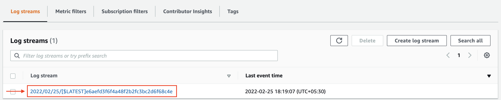

## Sample output

 * Click on **View as text** on top right to see the complete logs.
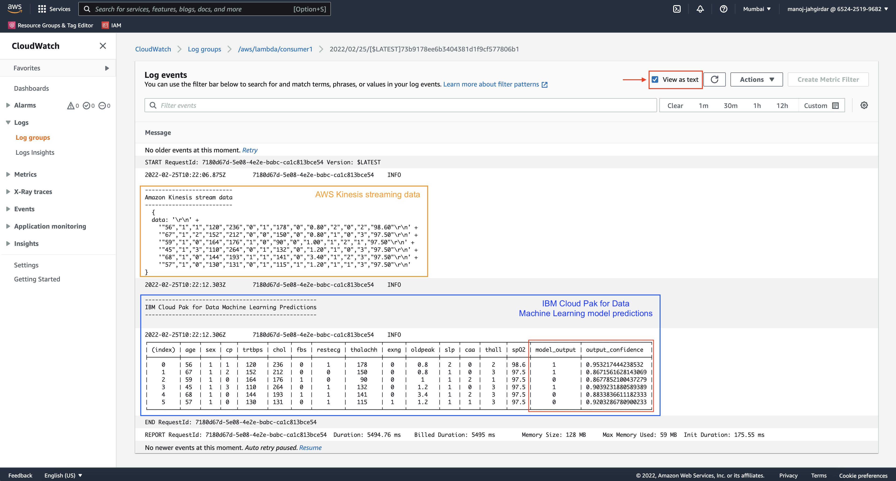

## Summary

In this code pattern, you learnt how to build a machine learning model with no code using SPSS Modeler on IBM Cloud Pak for Data, create a streaming flow using Amazon Kinesis on AWS Cloud and invoke the model using AWS Lambda function to get predictions and view in real-time on Amazon CloudWatch.

## Future scope
This code pattern can be further extended by visualizing the results using IBM Cloud Pak for Data Embedded Dashboard.

<!-- keep this -->
## License

This code pattern is licensed under the Apache License, Version 2. Separate third-party code objects invoked within this code pattern are licensed by their respective providers pursuant to their own separate licenses. Contributions are subject to the [Developer Certificate of Origin, Version 1.1](https://developercertificate.org/) and the [Apache License, Version 2](https://www.apache.org/licenses/LICENSE-2.0.txt).

[Apache License FAQ](https://www.apache.org/foundation/license-faq.html#WhatDoesItMEAN)
