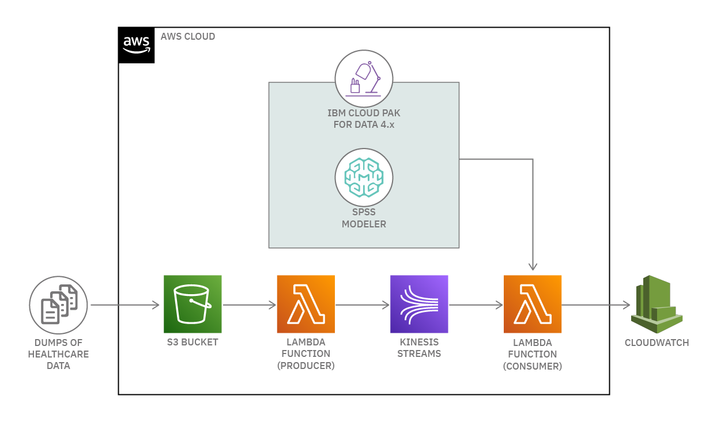

# Short Title

Proactive Healthcare management system

# Long Title

Proactive Healthcare management system with AWS Kinesis and IBM Cloud pak for Data

# Author
* [Manoj Jahgirdar](https://developer.ibm.com/profiles/manoj.jahgirdar)
* [Rahul Reddy Ravipally](https://developer.ibm.com/profiles/raravi86)
* [Srikanth Manne](https://developer.ibm.com/profiles/srikanth.manne)
* [Balaji Kadambi](https://developer.ibm.com/profiles/bkadambi)
* [Manjula Hosurmath](https://developer.ibm.com/profiles/mhosurma)

# URLs

### Github repo

* https://github.com/IBM/proactive-healthcare-management-cpd-aws

# Summary

In this code pattern, you will learn to build a machine learning model with no code on IBM Cloud Pak for Data, create a streaming flow on AWS Cloud and invoke the model to get predictions in real-time.

IBM Services used in the code pattern:
* IBM Cloud Pak for Data
  * Watson Studio
  * Watson Guided ML (Modeler Flow)
  * Watson Machine Learning

AWS Services used in the code pattern:
* AWS IAM Roles
* Amazon Kinesis
* AWS Lambda Functions
* Amazon CloudWatch
* Amazon S3

# Description

In the healthcare domain, there is a lot of real-time data that is generated. This real-time data needs to be monitored to generate predictions and alerts for healthcare professionals. A manual monitoring of such data is difficult. Hence in this code pattern we add AI based predictions and automate the monitoring of healthcare data. To demonstrate IBM Cloud pak for Data technology on AWS Cloud, we have taken the use case of predicting cardiac events based on real-time monitoring of patients health data.

Once you complete the code pattern, you will learn to:

* Create a S3 bucket on AWS.
* Create an event notification for the S3 bucket to trigger functions on adding data to the bucket.
* Create IAM Roles to AWS Services.
* Create a Lambda producer function to encrypt the data from S3 bucket and send it to Amazon Kinesis.
* Create a Machine Learning model using Guided ML (Modeler Flow) on IBM Cloud Pak for Data.
* Deploy the Machine Learning model on IBM Cloud Pak for Data Watson Machine learning and get the APIs to Invoke the model.
* Create a Lambda consumer function to decrypt the streaming data from Amazon Kinesis and send it to the model to get predictions.
* View the real-time predections from IBM Cloud Pak for Data Watson Machine Learning in Amazon CloudWatch.

Anyone using AWS services will be able to seamlessly plug in the IBM Cloud pak for Data Watson Machine Learning model to their flow.

# Flow

<!--add an image in this path-->

1. Healthcare data is dumped into a S3 bucket on AWS.
1. A producer lambda function is triggered to encrypt the data and stream it to AWS Kinesis.
1. A machine learning model is trained in IBM Cloud pak for Data Watson Studio using Guided ML (Modeler Flow) and the model is deployed in Watson Studio Machine Learning.
1. A consumer lambda function reads the data from kinesis streams.
1. The consumer function invokes the model from Watson Studio Machine Learning with the data received from kinesis streams.
1. The data streamed from the kinesis along with the predictions received from the Watson Studio Machine Learning are then visualized in AWS CloudWatch.

# Instructions

> Find the detailed steps in the [README](https://github.com/IBM/proactive-healthcare-management-cpd-aws/blob/master/README.md) file.

1. Create a S3 bucket
1. Create a Kinesis Stream
1. Create an IAM Role to AWS services
1. Create Producer Lambda Function
1. Create an event notification for the S3 bucket
1. Build and Deploy Watson Machine Learning model
   * 6.1. Build a machine learning model using Guided ML
   * 6.2. Deploy the model in Watson Machine Learning
   * 6.3. Copy the Watson Machine Learning Token
1. Create Consumer Lambda Function
1. Upload data to S3 bucket
1. View Logs in CloudWatch

# Components and services

* IBM Cloud Pak for Data
  * Watson Studio
  * Watson Guided ML (Modeler Flow)
  * Watson Machine Learning
